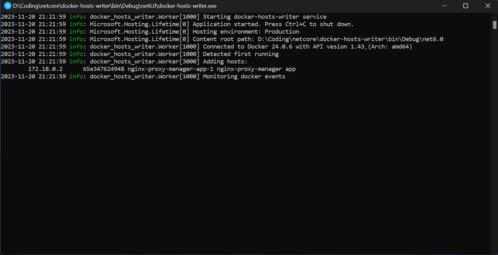

<a name="readme-top"></a>

<div align="center">
  <a href="https://github.com/bramanda48/docker-hosts-writer">
    
  </a>
  <h2 align="center">Docker Hosts Writer</h2>
  <div align="center">
    <p align="center">Small tool to add container address into hosts file on Windows and Linux</p>
    <div>
        <a href="https://github.com/bramanda48/docker-hosts-writer/actions?query=workflow:%22Build+.NET+6%22"></a>
        <a href="https://github.com/bramanda48/docker-hosts-writer/releases/"></a>
        <a href="#license"></a>
    </div>
  </div>
</div>

## Installation & Usage
1. Download latest version application in [Release Page](https://github.com/bramanda48/docker-hosts-writer/releases/)
2. Open the application. if the app asks for administrator permission, click yes.

## Help
This application also provides special options to set location of the hosts file, docker endpoint etc via command line arguments. 
<br/>You can use `--help` options to see the list argument.

```
docker-hosts-writer 1.0.0
Copyright (C) 2023 bramanda48

  -e, --endpoint      (Optional) Docker Engine API endpoint. Default:
                      in Windows = npipe://./pipe/docker_engine
                      in Linux = unix:///var/run/docker.sock

  -f, --hosts-file    (Optional) Hosts location. Default:
                      in Windows = %windir%\system32\drivers\etc\hosts
                      in Linux = /etc/hosts

  -s, --suffix        (Optional) Suffix for every domain.

  -p, --prefix        (Optional) Prefix for every domain. Default: .docker

  -v, --verbose       (Optional) Set output to verbose messages.

  --help              Display this help screen.

  --version           Display version information.
```

## License

This project is licensed under the MIT License - see the [LICENSE.md](https://github.com/bramanda48/docker-hosts-writer/blob/master/LICENSE.md) file for details

## Acknowledgments

Inspiration, code snippets, icon, etc.
* [Logo or Application Icon](https://www.flaticon.com/free-icon/web_7362015) by Fathema Khanom in [Flaticon](https://www.flaticon.com/)
